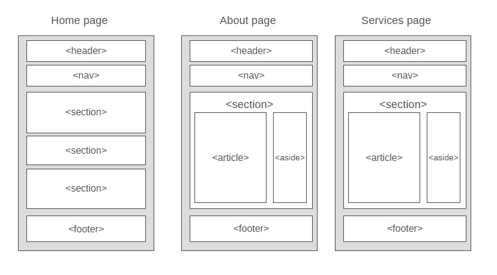

# Development Strategy

> `Acme-web-design` reproduced by Nadia

write a short description of your project:

This project represents a HTML website of a company with responsive mobile-friendly design. 

The development process is based on implementing each user story on a separate branch. The branch shall contain only the user-story related code, and it should work.

## Wireframe

<!-- include a wireframe for your project in this repository, and display it here -->
<!-- wireframe.cc is a good site for getting started with wireframes -->

## 0. Set-Up

__A User can see my initial repository and live demo__

### Repo

- Generate from Template
- Write initial, basic README
- Turn on GitHub Pages

## 1. header

__As a site visitor, I want to know what the content of the website is__

### Repo

This user story was developed locally on a brach called `header`  
The new branch was merged to `master` when the feature was finished.

### HTML

A header element with a Brand logo heading and nav bar

### CSS

Styling the page layout  
Slyling the layout of the header element and nav element  
Styling text for the page title and nav tabs

## 2. showcase

__As a site visitor, I want to read the company presentation__

### Repo

This user story was developed locally on a brach called `showcase`  
The new branch was merged to `master` when the feature was finished.

### HTML

A section element with a company description heading
Some text introducing visitors to company activities

### CSS

Slyling for the element
Styling for the text of the heading and paragraph

## 3. newsletter

__As a site visitor, I want to receive latest company's news__

### Repo

This user story was developed locally on a brach called `newsletter`  
The new branch was merged to `master` when the feature was finished.

### HTML

A section element with heading  
A subscription form with input and a button  

### CSS

Styling for the element  
Styling for the heading text  
Styling for the form input and form button

## 4. company expertise

__As a site visitor, I want to learn what programming languages and activities the company does__

### Repo

This user story was developed locally on a brach called `expertise`  
The new branch was merged to `master` when the feature was finished.

### HTML

A section element with several images, texts, descriptions

### CSS

Styling for the element  
Styling for the images, texts, descriptions  
Styling for the images

## 5. footer

__user story title__

### Repo

This user story was developed locally on a brach called `footer`  
The new branch was merged to `master` when the feature was finished.

### HTML

A simple footer with copyright text.

### CSS

Layout styling for the footer.

## 6. about page

__user story title__

### Repo

This user story was developed locally on a brach called `about`  
The new branch was merged to `master` when the feature was finished.

### HTML

* The new page title
* The new nav tab marked as current
* An article element with headings and descriptions about the company
* An aside element with heading and description about company's activities

### CSS

* New layout styling for section element with main text
* New layout styling for article and aside
* New styling for article paragraph

## 7. services page

__As a site visitor, I want to read more about company services and get a quote for it__

### Repo

This user story was developed locally on a brach called `services`  
The new branch was merged to `master` when the feature was finished.

### HTML

* The new page title
* The new nav tab marked as current
* An article element with list of headings and descriptions about the company services
* An aside element with quote form

### CSS

* Styling for the list items
* Styling for the quote inputs

## Finishing Touches

- Write final, complete README:
  - [makeareadme.com](https://www.makeareadme.com/)
  - [bulldogjob](https://bulldogjob.com/news/449-how-to-write-a-good-readme-for-your-github-project)
  - [meakaakka](https://medium.com/@meakaakka/a-beginners-guide-to-writing-a-kickass-readme-7ac01da88ab3)
- Validate code to check for any last mistakes
